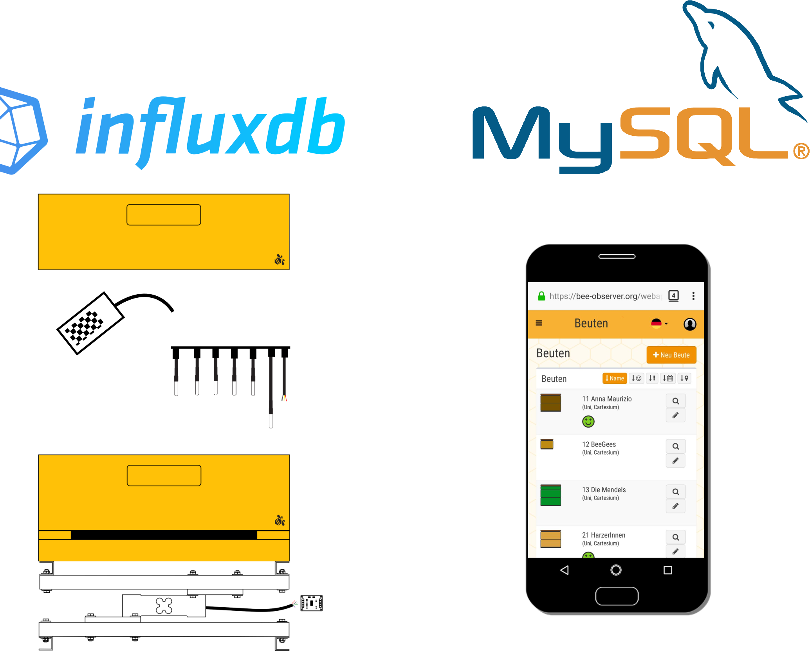
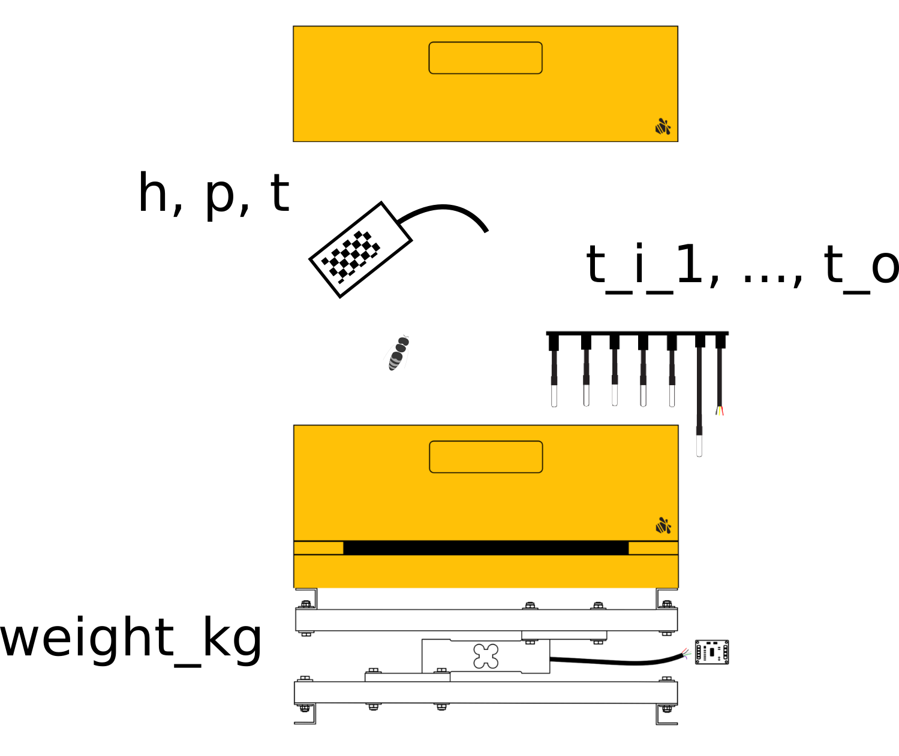
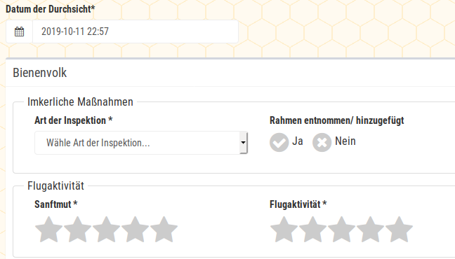

```{r setup, include=FALSE}
knitr::opts_chunk$set(echo = TRUE)
```

# About

This is a short overview about the current options of obtaining the bee observer data.

## Links

[Schedule of the Meeting](https://docs.google.com/document/d/1CxwaMsYHWoPDdNm3H8gsfFQe_KHA4v7BMd2KCZ7r3Z0/edit)

[Hiverize](https://hiverize.org/) (information about the bee observer project)

[Bob App](https://bee-observer.org/) (app used by bee keepers)

[Hiveeyes](https://hiveeyes.org/) (platform for advanced questions)

# Data Sources



# Influx - DB

## covariates



"time": timestamp of the measurement

"bv": not used

"h": humidity (%)

"key": sensor key

"name": not used

"p": air pressure (hectopascal or mbar ?)

"rssi": not used

"snr": not used

"t": temperature by "humidity sensor" (bme)

"t_i_1" to "t_i_5": temperature inside

"t_o": temperature outside

"weight_kg": weight including hive, bees and honey


## data access
There used to be an own package for influxdb access called "influxdbr", but apparently it's not mantained anymore.

However, we can use cURL (Client URL) and http.

We wrote a function to read sensory data directly from R. If you are interested in details, you can look at the source code here. No worries, you don't actually need to understand it in order to use it.
```{r, code = readLines("influx.r")}
```
You might need to install the package httr first. You also need to install OpenSSL, but R will explain you how to do this.

Here are two examples on how to use the function:
```{r eval=F}
source("influx.r")

df <- influx.read("select * from sensors where \"key\" = 'Q05rcH1lquY8YrYN' and time >= now() -1h", "user", "password")
head(df)

df <- influx.read("select * from sensors where time >= now() -1h", "user", "password")
head(df)
```


# Bob-App

## data structure


The inspections list consists of categories. Categories can have subcategories.
As you can see, there are different data types.


## data access

As an example, we provide a database dump. You can download it from seafile. Put it in the directory ``/data/``.

```{r}
inspections <- read.csv("data/inspection_items.csv")
```

```{r echo=F}
library(knitr)
kable(tail(inspections))
```


